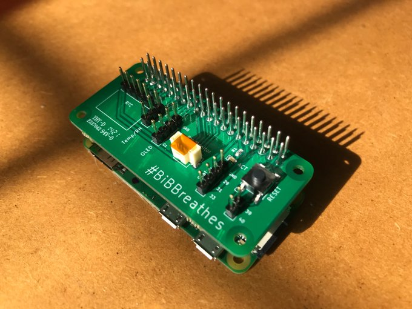

# bibsensor

Raspberry Pi based air quality sensor for the BiB (Born in Bradford) Breathes project.



## Hardware

The sensor software is designed for use with a Raspberry Pi Zero (though has also been tested successfully with other Raspberry Pi devices), with a connected BiB custom printed circuit board (PCB).

The status LED on the PCB is used to indicate the status of the device's internet connection. The PCB also houses a _reset_ switch which can be pressed to cleanly shut down the device.

Using the connections on the PCB, the sensor can have a real time clock connected, an Alphasense R1 or R2 sensor, a Sensirion SPS030 sensor, a temperature + humidity sensor.

If a GPS device is connected (e.g. via USB), the location information will be logged, and the GPS device will also be used as a time source.

## Set up

The [setup](setup/) directory contains a script, `bibsensor-setup.sh`, and necessary files to install and configure all of the sensor code.

The set up script is intended to be run on a Raspberry Pi device installed with [Raspbian](https://www.raspberrypi.org/software/operating-systems/) _OS Lite_, and has been tested with the _buster_ release of the operating system. 

Once the operating system has been installed, the following is done to set up the sensor software:

* Connect device to the internet
* Log in as default `pi` user
* Use `sudo -i` to switch to `root` user
* Set root password with `passwd`
* Log out and log back in as `root` user
* Rename `pi` user to `sensorpi` and move home directory:
```
usermod -m -d /home/sensorpi -l sensorpi pi
```
* Set password for `sensorpi` user:
```
passwd sensorpi
```
* Enable ssh:
```
systemctl enable ssh
```
* Copy the `bibsensor` directory to `/opt/bibsensor`
* Reboot the system

After rebooting, the set up script can be run with:

```
cd /opt/bibsensor/setup
./bibsensor-setup.sh
```

The set up script configures the device and sets up the sensor software. This includes the following:

* Update all system packages
* Install additional software required for the sensor
* Install and configure `chrony` time service
* Set some default environment settings
* Configure wireless device settings (region, etc.)
* Configure wired network settings (`eth0`)
* Set up and install sensor software and services
* Configure Raspberry Pi boot files

The `eth0` device on the Pi (if present) will be configured to use DHCP, with a fallback IP address (i.e. if no DHCP information is received) of `10.3.141.2`).

The reset button is configured to shut down the operating system with the following line in the [`/boot/config.txt`](setup/setup_files/config.txt) file:

```
dtoverlay=gpio-shutdown,gpio_pin=21
```

Once the setup script has been run, the Raspberry Pi device can be rebooted, and the sensor should start to run.

## Sensor Software

There are various components of the sensor software, for which available configuration settings can be found in the file `/etc/bibsensor/bibsensor.conf`. By default, this will be a symlink to the configuration file at `/opt/bibsensor/etc/bibsensor/bibsensor.conf`. If changes to the configuration are required, it is recommended to remove the symlink and make a copy of the default file, which can then be edited, e.g.:

```
rm /etc/bibsensor/bibsensor.conf
cp /opt/bibsensor/etc/bibsensor/bibsensor.conf /etc/bibsensor/
```

### `bib-set-hostname`

The `bib-set-hostname` service runs the Python file `/opt/bibsensor/bin/bib-set-hostname` each time the system boots.

This checks for the default host name of `bibsensor-00` in the `/etc/hosts` and `/etc/hostname` files, and if the system is currently using the default host name, a new random name will be set and the system rebooted.

When creating system images which can be copied to SD cards to install new sensors, using the default host in the image will cause new names to be generated and set when the new sensors boot up for the first time.

### `bib-set-clock`

The `bib-set-clock` service runs at start up to set the system clock. Status can be checked with:

```
systemctl status bib-set-clock
```

On system start up the following command is run:

```
/opt/bibsensor/bin/bib-set-clock load
```

On system shut down the following command is run:

```
/opt/bibsensor/bin/bib-set-clock save
```

The file `/opt/bibsensor/bin/bib-set-clock` is a `bash` script.

On system start up, if a real time clock (RTC) device is attached, the system time will be set from the real time clock device. If a RTC device is not attached, then the system clock will be set using the `fake-hwclock` command, which will set the system time as it was when it when last shut down / when the `fake-hwclock` data was last saved.

On system shut down, the RTC time will be set from the system clock, and the `fake-hwclock` data will be saved.

The [`/boot/config.txt`](setup/setup_files/config.txt) file contains the following line to enable the RTC:

```
dtoverlay=i2c-rtc,ds1307
```

### `bib-ap` and `bib-ap-web`

The `bib-ap` service allows the sensor to act as a WiFi access point, so that the sensor can be configured to connect to a wireless network.

The service runs via the Python file `/opt/bibsensor/bin/bib-ap`.

When the system boots up, if the sensor has not previously been configured to connect to a wireless network, it will start the access point service (via `hostapd`), creating a wireless network which has the same name as the system host name. By default, this will be something like `bibsensor-aabbccddeeff`. The wireless network passphrase is set in the `bibsensor.conf` file and defaults to `bibsensor`. The `bib-ap-web` service is also started, which runs a simple Python / Flask web application which can be used to configure the wireless network to which the sensor can connect.

Once the `bib-ap` service is up and running, a client device can connect to this networ, and then point a web browser at [http://10.3.141.1/](http://10.3.141.1/), where `10.3.141.1` is the `AP_IP` address set in the `bibsensor.conf` file. Depending on your syste, / browser, it may be possible to access the configuration page via [http://bibsensor](http://bibsensor/).

The web page will allow setting of the system host name, and configure a SSID and a passphrase for a wireless network to connect. Once the values have been entered in to the web page, and the _Update and reboot_ button has been clicked, the sensor will reboot, and the browser may display an error.

All being well, the system will reboot, and connect to the configured

After entering the details in to the web page, the host name of the sensor is updated by modifying the `/etc/hosts` and `/etc/hostname` files, and the wireless network details are added to the `/etc/wpa_supplicant/wpa_supplicant.conf` file.

When the system boots, if the sensor has previously been successful in connecting to a wireless network, it will wait for the number of seconds specified by the `AP_DELAY` setting in the `[bib-ap]` section of the `/etc/bibsensor/bibsensor.conf` file, which defaults to 60 seconds. After this delay, if the system has an active internet connection, the `bib-ap` service will exit. If there does not appear to be an active internet connection, then the `bib-ap` service will start up for the number of seconds specified by the `AP_TIMEOUT` option in the `[bib-ap]` section of the `/etc/bibsensor/bibsensor.conf` file, which defaults to 600 seconds. For this period, the sensor wireless access point will be active, and it will be possible to configure a new wireless network. When this time period is up, the system will reboot.

### `bib-status-led`

The `bib-status-led` service runs at system start up and changes the status of the LED on the BiB PCB, depending on the status of the sensors connection to the outside world.

If the system is able to resolve addresses to host names via DNS, then it is presumed that the internet connection is working correctly, and the LED will be permanently switched on. The connection is checked periodically, as defined by the `STATUS_POLL_DELAY` setting in the `[bib-status-led]` section of the `/etc/bibsensor/bibsensor.conf` file, which defaults to 10 seconds. If name resolution fails, but it is possible to connect to a specified port on a remote system, then the LED will blink three times.

The service runs via the Python file `/opt/bibsensor/bin/bib-status-led`.

The `[bib-status-led]` section of the `/etc/bibsensor/bibsensor.conf` file specifies the GPIO pin to which the LED is connected (the default is 5), and the remote address and port which are used to check the connection to the outside world. These default to:

```
CHECK_HOST = 8.8.8.8
CHECK_PORT = 53
```

This is Google's public DNS service, where `8.8.8.8` should resolve to `dns.google`, and 53 is the port on which the DNS service runs.

### `bib-sensor`

The `bib-sensor` service is the process which polls the connected sensors and logs the data.

The service runs via the Python file `/opt/bibsensor/bin/bib-sensor`, using the Python virtual environment created by the setup script in `/opt/bibsensor/venvs/bib-sensor`.

Various configuration options for the service can be found in the `[bib-sensor]` section of the `/etc/bibsensor/bibsensor.conf` file.

When the service starts, it will first check for connected GPS, temperature + humidity, Alphasense R1 or R2 and Sensirion SPS030 sensors. If neither an Alphasense or Sensirion sensor is connected, then the process will exit.

The systemd unit file for the service is located at `/opt/bibsensor/etc/systemd/system/bib-sensor.service`, with a symlink to this file at `/etc/systemd/system/bib-sensor.service`. This file includes some options to restart the service automatically:

```
Restart=always
RestartSec=300
```

The service will automatically restart after 5 minutes if the process exits. The systemd file also contains:

```
StartLimitIntervalSec=10800
StartLimitBurst=3
OnFailure=systemd-reboot.service
```

This means that if the service fails to start 3 times within three hours, the service will be considered to have failed, and the system will reboot.

The `bib-sensor` service polls the connected sensors at the frequency specified by the `POLL_INTERVAL` configuration option, which defaults to 10 seconds. If all sensors are connected, at each time interval the date and time will be logged along with temperature and relative humidity values, location values from the GPS, and the various values reported by the Alphasense and Sensirion sensors.

The `bib-sensor` service logs data to daily CSV files, in the location specified by the `DATA_DIR` configuration option, which defaults to `/data/bib-sensor`, with the frequency at which data is written to the file taken from the `LOG_INTERVAL` option, which defaults to 60 seconds.

The `bib-sensor` service also creates a `sysinfo.csv` file in the `DATA_DIR`, which is updated each time data is logged. This contains a few bits of potentially useful information, including the system serial number, IP address, and the serial number of the Alphasense and Sensirion sensors.

### `bib-data-archive`

The `bib-data-archive` service is used to archive collected sensor data, by uploading files to a Microsoft Sharepoint site and then moving the files which have been uploaded to an archive directory.

The service runs via the Python file `/opt/bibsensor/bin/bib-data-archive`, using the Python virtual environment created by the setup script in `/opt/bibsensor/venvs/bib-data-archive`.

Various configuration options for the service can be found in the `[bib-data-archive]` section of the `/etc/bibsensor/bibsensor.conf` file.

The configuration details for the Sharepoint site to which the data will be uploaded is configured by the environment variables:

* `SP_URL`: URL of the Sharepoint site
* `SP_DIR`: Directory in the Sharepoint site to which data will be uploaded
* `SP_USER` and `SP_PASS`: User credentials for connecting to the Sharepoint site

The service runs as the `sensorpi` user, and these variables are set in the `/home/sensorpi/.bib-data-archive`. The systemd unit file for the service, `/opt/bibsensor/etc/systemd/system/bib-data-archive.service` which is symlinked from `/etc/systemd/system/bib-data-archive.service`, contains the following line to read in this file and set these variables:

```
EnvironmentFile=/home/sensorpi/.bib-data-archive
```

The systemd service file also contains the following lines to restart the service on failure:

```
Restart=on-failure
RestartSec=300
```

As the service can hang if the internet connection is lost while a file is being uploaded, a `cron` job is in place, within `/etc/cron.d/bib-data-archive`, which should be a sylink to `/opt/bibsensor/etc/cron.d/bib-data-archive`, and this restarts the service every three hours.

At the interval specified by the `ARCHIVE_INTERVAL` configuration, which defaults to 600 seconds, the service will upload any CSV files in the `DATA_DIR`, which defaults to `/data/bib-sensor`. Any files which have not been updated for more than the `ARCHIVE_AGE` number of seconds, which defaults to 3600, will be moved to the `ARCHIVE_DIR`, which defaults to `/data/archive/bib-sensor`. The most recent data and `sysinfo` CSV files will never be archived.

### `bib-update`

The `bib-update` service is used to apply any required updates to the sensors.

The service runs via the Python file `/opt/bibsensor/bin/bib-update`.

Configuration options for the service are found in the `[bib-update]` section of the `/etc/bibsensor/bibsensor.conf` file.

The systemd service file is located at `/opt/bibsensor/etc/systemd/system/bib-update.service` which is symlinked from `/etc/systemd/system/bib-update.service`. The systemd service file contains the following lines to automatically restart the service on failure:

```
Restart=on-failure
RestartSec=300
```

The service will run at the interval specified by the `UPDATE_INTERVAL`, which defaults to 3600 seconds. Each time the update runs the Git repository specified by the `GIT_REPO` option will be cloned in to the `TEMP_DIR` location, and the `UPDATE_FILE` which is expected to exist within the repository will be run.

By default, the Git repository used for updates is the `cemac/bibsensor-updates` GitHub repository, which is a private repository, and access is granted to the sensors using the GitHub deploy keys feature.
